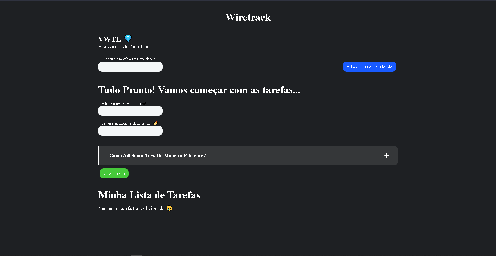

<p align="center"><a href="https://www.linkedin.com/in/wiriyamu/" target="_blank" rel="noopener noreferrer"></a></p>
<h1 align="center"> Wiretrack 🏢</h1>

<!-- Index session-->
<p align="center">
 <a href="#-sobre-o-projeto">Sobre</a> •
 <a href="#-layout">Layout</a> • 
 <a href="#-funcionalidades">Funcionalidades</a> • 
 <a href="#-tecnologias">Tecnologias</a> • 
 <a href="#-como-executar-o-projeto">Como executar o projeto</a> 
</p>

<!--About session-->

## 💻 Sobre o projeto

O VWTL (Vue Wiretrack Todo List) é um app todo list feito como desafio técnico para a Wiretrack.

---

<!--Layout session-->

## 🎨 Layout

<p align="center"></a></p>

## <!--Functionalities session-->

## ⚙️ Funcionalidades

- [x] VWTL:

  - [x] Adicionar e Remover TODOS
  - [x] Adicionar Tags aos TODOS
  - [x] Marcar os TODOS que foram finalizados
  - [x] Filtre seus TODOS por título e tags
  - [x] Guardar as informações da lista de TODOS no LocalStorage

---

<!--Tecnologies session-->

## 🛠 Tecnologias

As seguintes ferramentas foram usadas na construção do projeto:

#### **Front-end** ([HTML](https://developer.mozilla.org/pt-BR/docs/Web/HTML) + [CSS](https://developer.mozilla.org/pt-BR/docs/Web/CSS) + [Sass](https://sass-lang.com/) + [JS](https://developer.mozilla.org/pt-BR/docs/Web/JavaScript) + [Vue](https://br.vuejs.org/) + [Vuesax](https://lusaxweb.github.io/vuesax/))

> Veja o arquivo [package.json](./package.json)

#### **Deploy**

- Frontend: **[Vercel](https://vercel.com/)**

#### **Utilitários**

- Editor: **[Visual Studio Code](https://code.visualstudio.com/)** → Extensions: **[Vetur](https://marketplace.visualstudio.com/items?itemName=octref.vetur)**

---

<!--Running session-->

## 🚀 Como executar o projeto

<!--Obs-->

### Pré-requisitos

- [Git](https://git-scm.com)
- [Node.js](https://nodejs.org/en/)

#### 🎲 Rodando o projeto - Frontend

```bash

# Clone o repositório
$ git clone

# Acesse a pasta do projeto no prompt de comando
$ cd vue-wiretrack-todo-list

# Instale as dependências
$ yarn

# Execute o script "serve"
$ yarn serve

# O projeto inciará na porta: 8080 - acesse http://localhost:8080

```

---

<!--Bottom session-->
<h4 align=center>Feito com ❤️ por Willian Silva 👋 <a href="https://www.linkedin.com/in/wiriyamu/">Entre em contato :)</a></a></h4>
